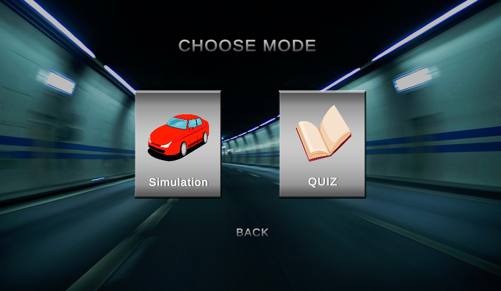
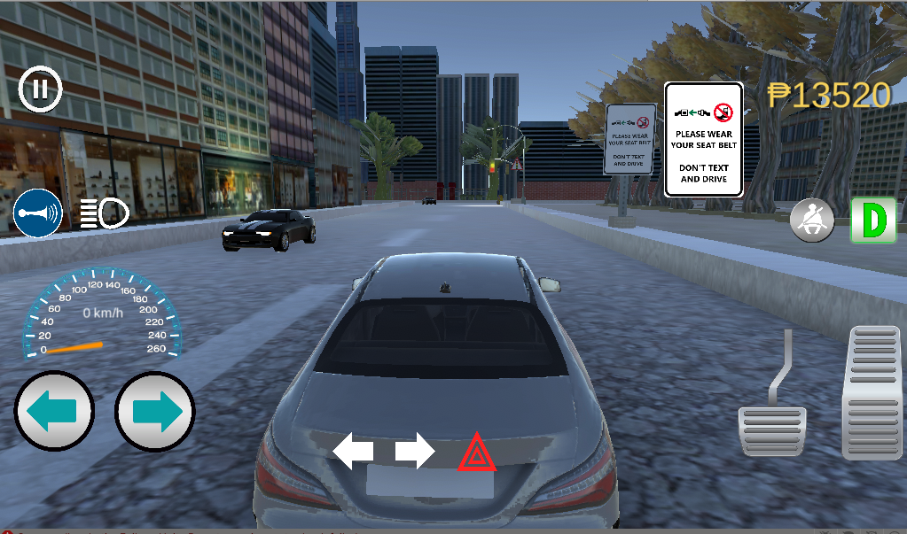
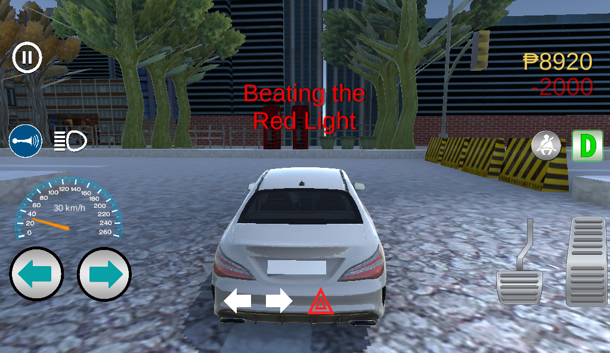
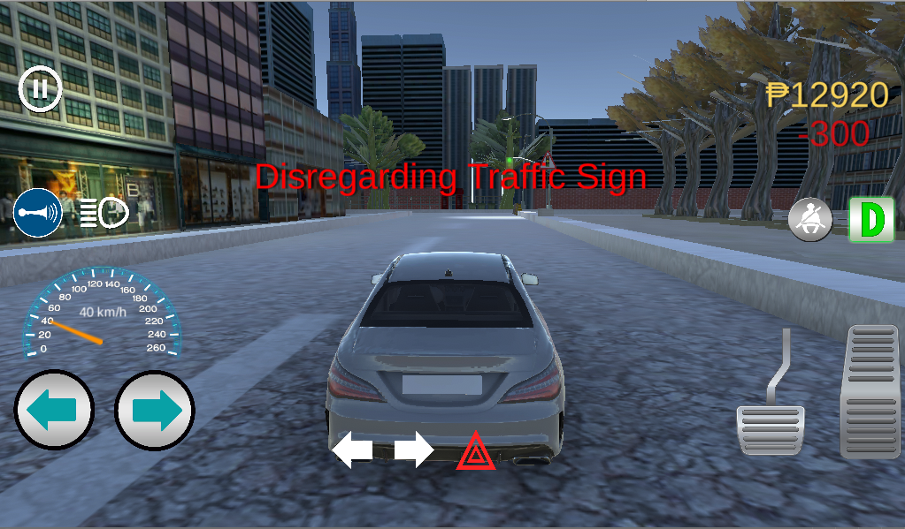
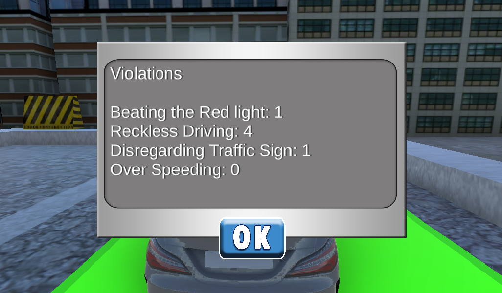
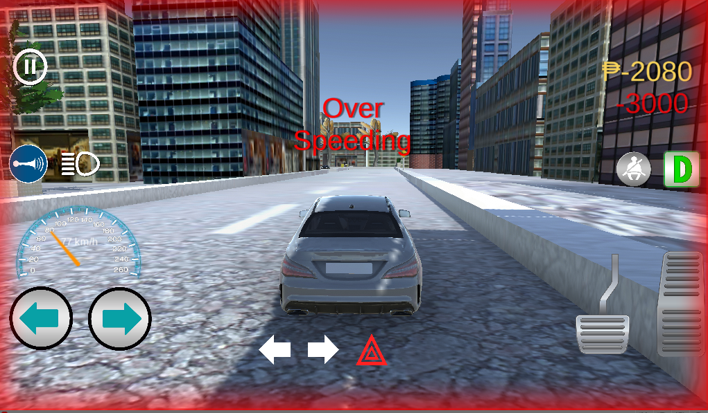
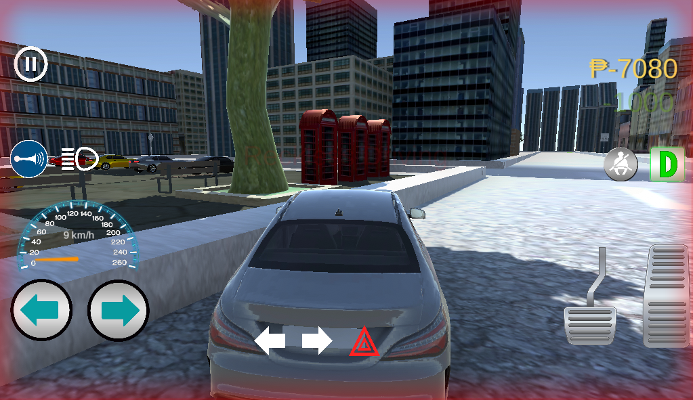
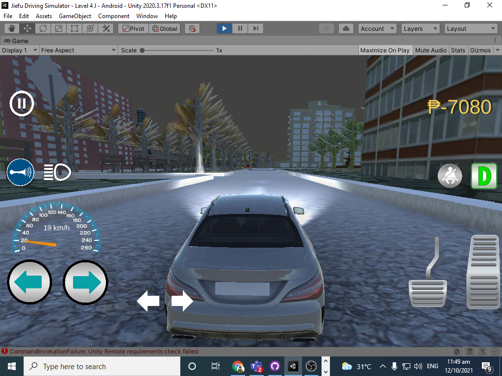

  
 
  <h3 align="center">Jiefu Driving Simulator</h3>

  

    A Driving simulator with real life Philippine road challenges, Traffics and rules
     
   <a href="https://github.com/RJAmoto"><strong>Follow me on Github</strong></a>
   .
   <a href="https://https://www.upwork.com/freelancers/~01f821e50fba8d65f2"><strong>Upwork</strong></a>
   .
   <a href="https://www.linkedin.com/in/rudolph-john-agpoon-602370223/"><strong>Linked in</strong></a>
  

 This is a driving simulation game that can educate the user and by using the rules and regulation based on the Philippine traffic rules and regulation. Users will be educated by a quiz mode on the game which is also a reviewer if ever that they want to get a license. They may also test their skills using the actual driving simulation that incorporates real life scenarios in Philippine roads.

#### Watch our trailer on Youtube
   
https://youtu.be/ZzQ0zjj0o3o

  
  

 
## About the project
 
 ### Features 
 * Traffic light Control System
 * Violation Triggers
 * 10 Levels
 * Quiz mode
 * Simulation Mode
 * Menu Screen and Settings
 * Sound effects
 * Pause and Resume
 * Monetary System and Rewards
 
 ### Car Modules
 * Head Lights
 * Brake Lights
 * Signal Lights
 * Horn
 * Reverse and Drive
 * Brake
 * Speedometer
 * Seatbelt
 * Left and Right Button Steering
 
 
## Screenshots

 
 
 
 
 
 
 

 
## Authors

* **Rudolph John Agpoon**
* **Nomer Fabroliña**
* **Jeff Rivera**
* **Richmond Ramil** 1

## Installation Guide
